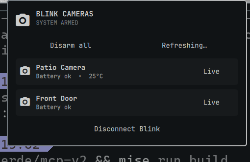

# Blink Cameras for Omarchy



A native [Omarchy](https://omarchy.org/) Quattro bar widget for Amazon Blink
cameras. Check your system at a glance, arm or disarm it, and open an on-demand
live view without reaching for your phone.

> [!IMPORTANT]
> This community project is not affiliated with Amazon, Blink, or Immedia. It
> uses Blink's private cloud API through
> [BlinkPy](https://github.com/fronzbot/blinkpy), so upstream changes can
> occasionally require a plugin update.

## Features

- Armed/disarmed status in the Omarchy bar
- One-click arm or disarm for all Blink systems
- Camera battery, temperature, and motion status
- Embedded, on-demand live video for each supported camera
- Guided email/password and 2FA connection flow inside the panel
- Automatic dependency setup and caching through `uv`
- Configurable refresh interval, limited to a Blink-friendly minimum of 60 seconds
- No saved password and no secrets inside the plugin directory

## Install

Install from the Omarchy Plugins marketplace when the listing is available, or
install directly from GitHub:

```sh
omarchy plugin add https://github.com/JonathanRiche/omarchy-blink.git --enable
```

The widget is placed in the right section of the bar by default. No Python,
`pip`, or virtual-environment setup is required.

## Connect Blink

1. Click the video-camera icon in the Omarchy bar.
2. Enter the email address and password used by the **Blink app**. This may be
   different from a linked Amazon account.
3. Enter the verification code Blink sends by SMS, WhatsApp, or email.
4. Wait for the camera list to appear.

The first connection can take a little longer while `uv` downloads the pinned
BlinkPy runtime. Later launches reuse its cache.

## Use

- Select **Arm all** or **Disarm all** to update every Blink system.
- Select **Refresh** to retrieve current device information.
- Select **Live** beside a camera to begin streaming in the panel.
- Click the video or close the panel to stop a live session.
- Select **Disconnect Blink** to remove the locally saved session.

Live sessions stop when the panel closes and are capped at five minutes so a
camera cannot remain streaming unnoticed.

## Configure

The default refresh interval is 60 seconds. Change it through Omarchy's bar
configuration or from the command line:

```sh
omarchy bar set io.github.jonathanriche.omarchy-blink refreshIntervalSec 120
```

Move the widget with the normal Omarchy bar command:

```sh
omarchy bar move io.github.jonathanriche.omarchy-blink --section right
```

## Privacy and security

- Your password is sent to the local helper over stdin, never in process arguments.
- Your password is discarded after the initial Blink authentication succeeds.
- Refresh-token data is stored at
  `~/.local/state/omarchy-blink/credentials.json` with user-only permissions.
- Credentials and camera data are never stored in this Git repository.
- Live video is proxied only over a loopback socket on your machine.
- Disconnecting removes the saved authentication and status cache.

See [SECURITY.md](SECURITY.md) for reporting security issues.

## Requirements

- Omarchy 4 with the Quattro shell
- `uv` (included with current Omarchy installations)
- Qt Multimedia support (included with Omarchy)
- Internet access to Blink and, on first use, the Python package index

## Troubleshooting

### The login is rejected

Use the credentials from the Blink mobile app, not automatically your Amazon
credentials. Test them in the Blink app or reset the Blink password if needed.

### A verification code does not arrive

Check the email address or phone configured in Blink. Blink may impose a short
wait before another code can be requested.

### Live view fails

Confirm the camera is online and not already busy recording or streaming.
Battery cameras may take several seconds to wake. Close the panel, reopen it,
and try once more.

### Inspect plugin logs

```sh
qs log -p /usr/share/omarchy/shell --tail 100 | grep -i blink
```

## Update or remove

```sh
omarchy plugin update io.github.jonathanriche.omarchy-blink
omarchy plugin remove io.github.jonathanriche.omarchy-blink
```

Removing the plugin does not silently delete your Blink session file. Use
**Disconnect Blink** first if you also want to remove local authentication.

## Development

```sh
omarchy plugin validate .
qmllint -I /usr/share/omarchy/shell BarWidget.qml Panel.qml
uvx ruff check blink_helper.py
uv run blink_helper.py status
```

Contributions are welcome. See [CONTRIBUTING.md](CONTRIBUTING.md).

## License

[MIT](LICENSE)
